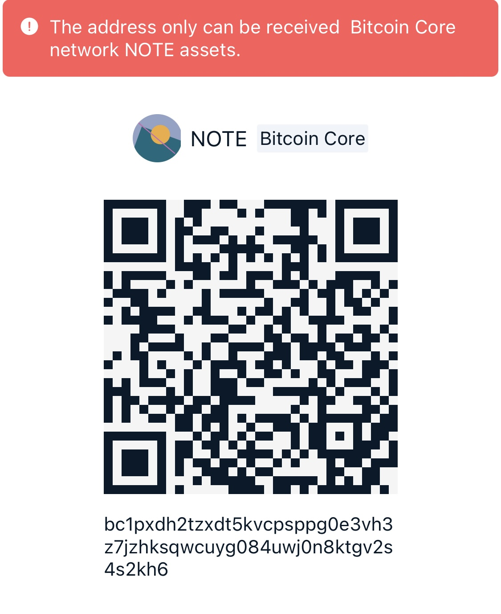

# N-Deployer

Deploy your own token of <a href="https://noteprotocol.org/">NOTE Protocol</a>.

Support connect to NOTE BTC network via ChainBow Wallet, Unisat Wallet and NOTEMarket Wallet (via <a href='https://github.com/NoteScan/n20-connect'>n20-connect</a>).

# Installation
Clone the repository to your computer and navigate to the directory:

```bash
git clone https://github.com/NoteScan/N-Deployer
cd N-Deployer
```

Install third-party packages using NPM or PNPM (recommended):

### NPM
```bash
npm i
```

### PNPM
```bash
pnpm i
```

# Run

### Run with NPM:
```bash
npm run start
```

### Run with PNPM:
```bash
pnpm start
```

Access the application in your web browser at http://localhost:3000.

# Deploy to Vercel
. Fork https://github.com/NoteScan/N-Deployer to your Github.

. Create a new project on Vercel.

. Import and deploy on Vercel.

### Demo
https://n-deployer-test.vercel.app/


# Licence

[MIT](./LICENSE)


## Support and Donation

If you find this project helpful and you would like to support its continued development, feel free to make a donation through one of the following methods. Your support is a tremendous encouragement for us!

You can also donate N20 Token using the following cryptocurrency addresses:

- BTC: bc1pxdh2tzxdt5kvcpsppg0e3vh3z7jzhksqwcuyg084uwj0n8ktgv2s4s2kh6



Thank you to every supporter for your contributions!
